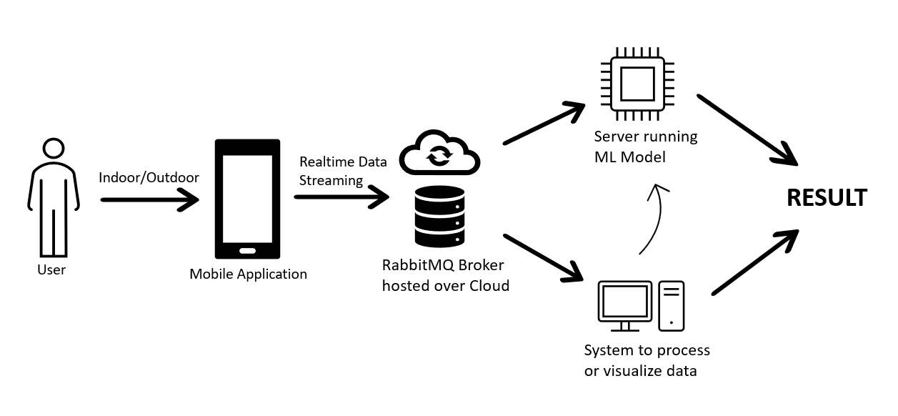

# Seamless Indoor-Outdoor Detection using Machine Learning

[Presentation Link](https://www.canva.com/design/DAGCUCAWIAM/Plfu8QpxUEn41Z6slt12fQ/edit?utm_content=DAGCUCAWIAM&utm_campaign=designshare&utm_medium=link2&utm_source=sharebutton)

## Abstract
Indoor-outdoor (IO) detection plays a pivotal role in various applications such as navigation and localization. It provides useful information for end-users, enabling applications to adapt their functionality based on whether the user is indoors or outdoors. By accurately distinguishing between indoor and outdoor environments, applications can provide tailored experiences to users. For instance, navigation apps can switch between indoor maps and outdoor routes seamlessly, providing more accurate and relevant guidance. In the past decade, a wide range of Indoor-Outdoor detection and localization techniques have been proposed. These techniques involve the use of Global Positioning System (GPS), cellular tower signals, Wi-Fi, Bluetooth, magnetometer, ambient Light sensors, and a variety of smartphone sensors. Some propose the use of a single technique like GPS or Magnetometer whereas some propose amalgamation of various sensors and techniques to provide better and precise detection. This project aims to compare the performances of different machine learning algorithms in discriminating IO environments without high energy consumption using lightweight smartphone sensors. Data have been acquired on different days and environments on a population sample of 5 subjects. Our analysis focused on testing multiple machine learning algorithms on the acquired dataset, with Random Forest exhibiting the highest accuracy among the tested algorithms. Our proposed algorithm achieved a remarkable accuracy of 92.67% in known environments where data were collected, and 85.64% accuracy in new indoor and outdoor scenarios. These results underscore the effectiveness of our approach in IO detection using readily available smartphone hardware and sensors, highlighting its compatibility and practicality for real-world applications.

Keywords: Indoor-Outdoor (IO) detection, lightweight smartphone sensors, machine learning, Random Forest.

## Guide

This Repository contains all the machine learning models and appplication build used in this project. The content is under GNU public license so anyone trying to conduct similar experiment can use any or all the code.

### Data

It contains two datasets namely Dataset_1 and Dataset_2, collected under similar environment in resedential areas.
[IOSYN](https://github.com/rishiagl/iosyn) application was used to collect data from android smartphones.

#### Application Installation:

Application can be installed using the app_debug.apk provided in the repository as well by directly building from the build file(app_debug.aab). For users using build file can refer to this [guide](https://stackoverflow.com/questions/53040047/generate-an-apk-file-from-an-aab-file-android-app-bundle).

### Machine Learning Model:

Different models used for experiment has been provided under models directory.

